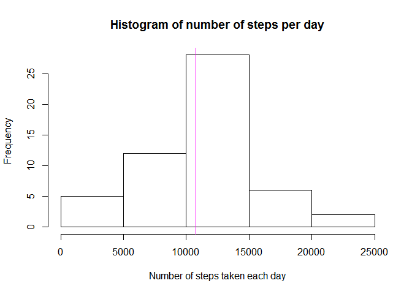
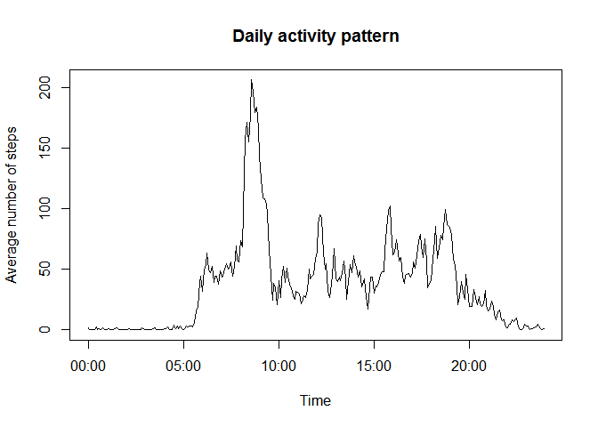
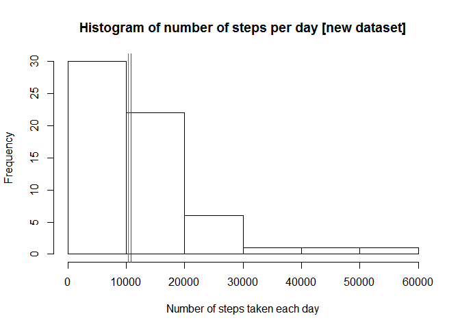
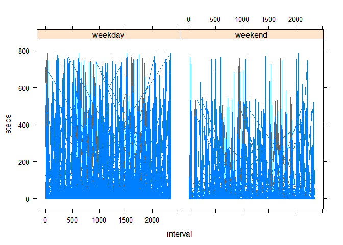

# Reproducible Research: Peer Assessment 1


## Loading and preprocessing the data


```r
## Loading the dataset
data<-read.csv("activity.csv")

## Converting the 5-min interval in time
interv<-as.character(format(as.numeric(levels(factor(data$interval)))/100,nsmall=2))
data$hour<-sub("\\.",":",interv)
data$time<-as.POSIXct(data$hour, format="%H:%M")
head(data)
```

```
##   steps       date interval  hour                time
## 1    NA 2012-10-01        0  0:00 2014-11-17 00:00:00
## 2    NA 2012-10-01        5  0:05 2014-11-17 00:05:00
## 3    NA 2012-10-01       10  0:10 2014-11-17 00:10:00
## 4    NA 2012-10-01       15  0:15 2014-11-17 00:15:00
## 5    NA 2012-10-01       20  0:20 2014-11-17 00:20:00
## 6    NA 2012-10-01       25  0:25 2014-11-17 00:25:00
```


## What is mean total number of steps taken per day?


```r
stepday<-aggregate(steps ~ date, data=data, sum)
hist(stepday$steps, xlab="Number of steps taken each day", main="Histogram of number of steps per day")

## Calculate mean and median and report them on histogram
stepday_mean<-mean(stepday$steps)
stepday_median<-median(stepday$steps)

abline(v=stepday_mean, col="red")
abline(v=stepday_median, col="magenta")
```

 

```r
## Mean of the total number of steps per day
stepday_mean
```

```
## [1] 10766.19
```

```r
## Median of the total number of steps per day
stepday_median
```

```
## [1] 10765
```
  
The mean of the total number of steps per day is **10766.19** (red line on histogram)  
The median of the total number of steps per day is **10765** (magenta line on histogram)
  

## What is the average daily activity pattern?


```r
stepinterv<-aggregate(steps ~ time+hour, data=data, mean)

plot(x=stepinterv$time,y=stepinterv$steps,type="l", main="Daily activity pattern", xlab="Time", ylab="Average number of steps")
```

 


## Imputing missing values


```r
## Nb of missing data per features
missingdata<-apply(data[,1:3],2,function(x) sum(is.na(x)))
missingdata
```

```
##    steps     date interval 
##     2304        0        0
```

```r
## Total nb of missing values
totalmissingdata<-sum(missingdata)
totalmissingdata
```

```
## [1] 2304
```
In the dataset, there are **2304** missing values  

### Creation of new datasets with estimated values for missing values

Missing data will be replaced by the mean at that time (5min interval)

```r
q<-merge(data,stepinterv,by.x="hour",by.y="hour")
indexna<-is.na(q$steps.x)
q2<-q
q2$steps.x[indexna]<-round(q$steps.y[indexna])
## Creation of new dataset (data2) with missing data replaced
data2<-data
data2$steps<-q2$steps.x
head(data2)
```

```
##   steps       date interval  hour                time
## 1     2 2012-10-01        0  0:00 2014-11-17 00:00:00
## 2     0 2012-10-01        5  0:05 2014-11-17 00:05:00
## 3     0 2012-10-01       10  0:10 2014-11-17 00:10:00
## 4     0 2012-10-01       15  0:15 2014-11-17 00:15:00
## 5     0 2012-10-01       20  0:20 2014-11-17 00:20:00
## 6     0 2012-10-01       25  0:25 2014-11-17 00:25:00
```
## Rebuilding the histogram of number of steps per day with new dataset


```r
stepday2<-aggregate(steps ~ date, data=data2, sum)
hist(stepday2$steps, xlab="Number of steps taken each day", main="Histogram of number of steps per day [new dataset]")

## Calculate mean and median and report them on histogram
stepday_mean2<-mean(stepday2$steps)
stepday_median2<-median(stepday2$steps)

abline(v=stepday_mean2, col="red")
abline(v=stepday_median2, col="magenta")
```

 

```r
## Mean of the total number of steps per day
stepday_mean2
```

```
## [1] 10765.64
```

```r
## Median of the total number of steps per day
stepday_median2
```

```
## [1] 10346
```

The mean of the total number of steps per day is **10765.64** (red line on histogram)  
The median of the total number of steps per day is **10346.00** (magenta line on histogram)  


```r
gap_mean<-round(100*abs(stepday_mean2-stepday_mean)/stepday_mean,2)
gap_mean
```

```
## [1] 0.01
```

```r
gap_median<-round(100*abs(stepday_median2-stepday_median)/stepday_median,2)
gap_median
```

```
## [1] 3.89
```

Imputing missing data has a negligible impact on mean (0.01%) but has a **significant impact on the median (3.89%)**  


## Are there differences in activity patterns between weekdays and weekends?

### Creation of 

```r
## Definition of weekday/weekend
dict_weekday<-data.frame("day"=weekdays(Sys.Date()+0:6),"type_day"=as.factor(c(rep("weekday",5),rep("weekend",2))))

## Creation of new column weekday/weekend (and of a temporary technical column : day)
data2$day<-weekdays(as.Date(data2$date))
data2<-merge(data2,dict_weekday,by.x="day",by.y="day")
## deletion of technical feature
data2$day<-NULL

head(data2)
```

```
##   steps       date interval  hour                time type_day
## 1   619 2012-10-21     2040 20:40 2014-11-17 20:40:00  weekend
## 2   129 2012-10-21     2000 20:00 2014-11-17 20:00:00  weekend
## 3     0 2012-10-21     2035 20:35 2014-11-17 20:35:00  weekend
## 4    61 2012-10-21     2240 22:40 2014-11-17 22:40:00  weekend
## 5   129 2012-10-21     2245 22:45 2014-11-17 22:45:00  weekend
## 6     0 2012-10-21     2005 20:05 2014-11-17 20:05:00  weekend
```

```r
## 2-facets plot
library(lattice)
stepinterv2<-aggregate(steps ~ interval+type_day, data=data2, mean)
#stepinterv2<-aggregate(steps ~ time, data=data2, mean)
#plot(x=stepinterv2$time,y=stepinterv2$steps,type="l", main="Daily activity pattern", xlab="Time", ylab="Average number of steps")
xyplot(steps~interval | type_day,data=data2,type="l")
```

 

